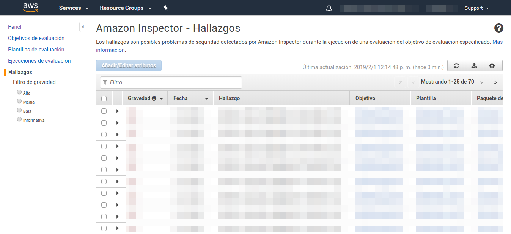
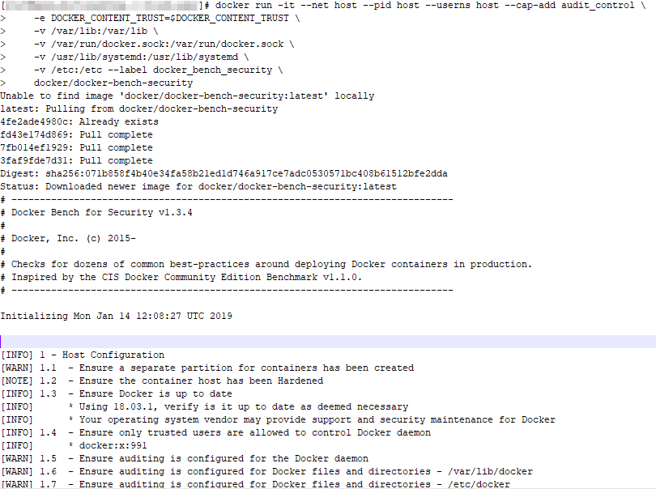

# DevSecOps Tools
Recopilación de herramientas complementarias para auditoría de Docker, K8, AWS, etc. 

Estas herramientas me han sido útiles en pentesting (tanto caja negra como blanca) y en la revisión de la seguridad de diferentes entornos y diferentes tecnologías.

---

## Índice

- [DevSecOps Tools](#devsecops-tools)
  - [Índice](#%C3%ADndice)
  - [Cumplimiento CIS](#cumplimiento-cis)
    - [AWS CIS](#aws-cis)
      - [Prowler](#prowler)
      - [AWS Inspector](#aws-inspector)
    - [Azure CIS](#azure-cis)
    - [Docker CIS](#docker-cis)
      - [Docker Bench for Security](#docker-bench-for-security)
    - [Kubernetes CIS](#kubernetes-cis)

---

## Cumplimiento CIS

### AWS CIS

#### [Prowler](https://github.com/toniblyx/prowler)

Es una herramienta en python que permite realizar un análisis del grado de cumplimiento con el bastionado CIS de el entorno en AWS además de diferentes grupos de checks predefinidos relacionados con el control IAM, monitorización, logging, forense entre otros.

Permite exportar los resultados en múltiples formatos (CSV, JSON, TXT, etc.)


#### [AWS Inspector](http://console.aws.amazon.com/inspector/)

Herramienta que permite realizar análisis de vulnerabilidades, cumplimiento CIS, nivel de exposición desde internet, etc. en las instancias virtuales de AWS. Trae implementado por defecto cinco tipos de escaneos: Runtime Behavior Analysis, Security Best Practices, Network Reachability, CIS Operating System Security Configuration Benchmarks (no están soportados todos los S.O.) y Common Vulnerabilities and Exposures aunque también se pueden crear plantillas de análisis personalizadas.

Para ejecutarlo hay que instalar el agente de Inspector en las máquinas virtuales y usando la propia interfaz web de la herramienta definir un "Objetivo de Evaluación" indicando el conjunto de instancias virtuales sobre las que realizar el análisis, definir la "Plantilla de Evaluación" para indicar el/los tipo/s de análisis a correr y una "Ejecución" en donde se puede lanzar manualmente o programar una tarea periódica para que se realice automáticamente.

En la sección "Hallazgos" están los resultados de los análisis ejecutados.



### Azure CIS

Aunque el benchmark CIS de Azure está definido y es posible encontrar y descargasr los benchmarks en diferentes formatos no he localizado ninguna herramienta que lo tenga incorporado, ni siquiera está en Nessus.


Es posible obtener este grado de cumplimiento a través de la herramienta "Security Center" integrada en la propia suscripción de Azure la cual además muestra el estado referente al cumplimiento PCI DSS, ISO 27001 y SOC TSP.


Para obtenerlo, no basta solo con activar el Security Center e instalar los agentes de monitorización en todos los nodos sino que hay que hacer uso de la versión "Standard" (de pago). Lo bueno que Microsoft deja un mes de prueba gratis para esta versión completa de Security Center y una vez lo tengamos es posible volverlo a desactivar.


### Docker CIS

#### [Docker Bench for Security](https://github.com/docker/docker-bench-security)

Este script comprueba automáticamente las buenas prácticas en el despligue de Dockers inspirado en el CIS Docker Community Edition Benchmark v1.1.0.

La manera más sencilla de correr esta herramienta es haciendo uso del contenedor ya definido por ellos el cual se puede correr en el host que queramos comprobar. Antes de ello hay que ajustar los volúmenes a compartir con el Docker para ajustarlos según el S.O. que se vaya a auditar.

```bash
docker run -it --net host --pid host --userns host --cap-add audit_control \
    -e DOCKER_CONTENT_TRUST=$DOCKER_CONTENT_TRUST \
    -v /var/lib:/var/lib \
    -v /var/run/docker.sock:/var/run/docker.sock \
    -v /usr/lib/systemd:/usr/lib/systemd \
    -v /etc:/etc --label docker_bench_security \
    docker/docker-bench-security
```


### Kubernetes CIS